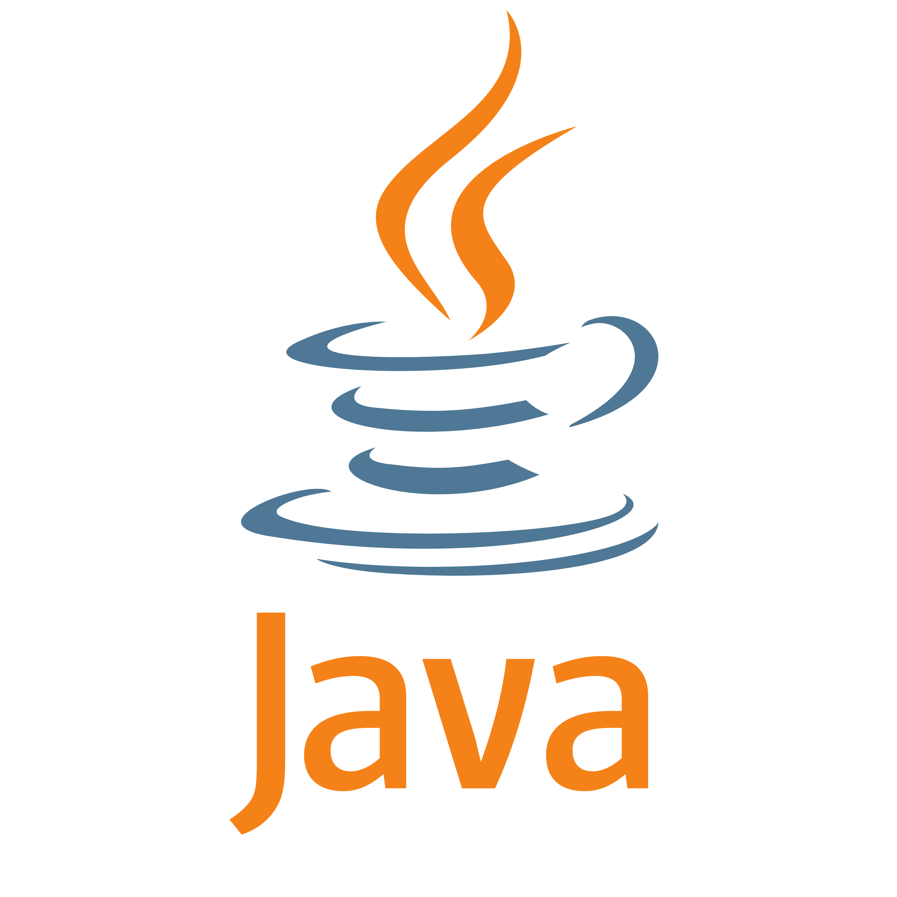
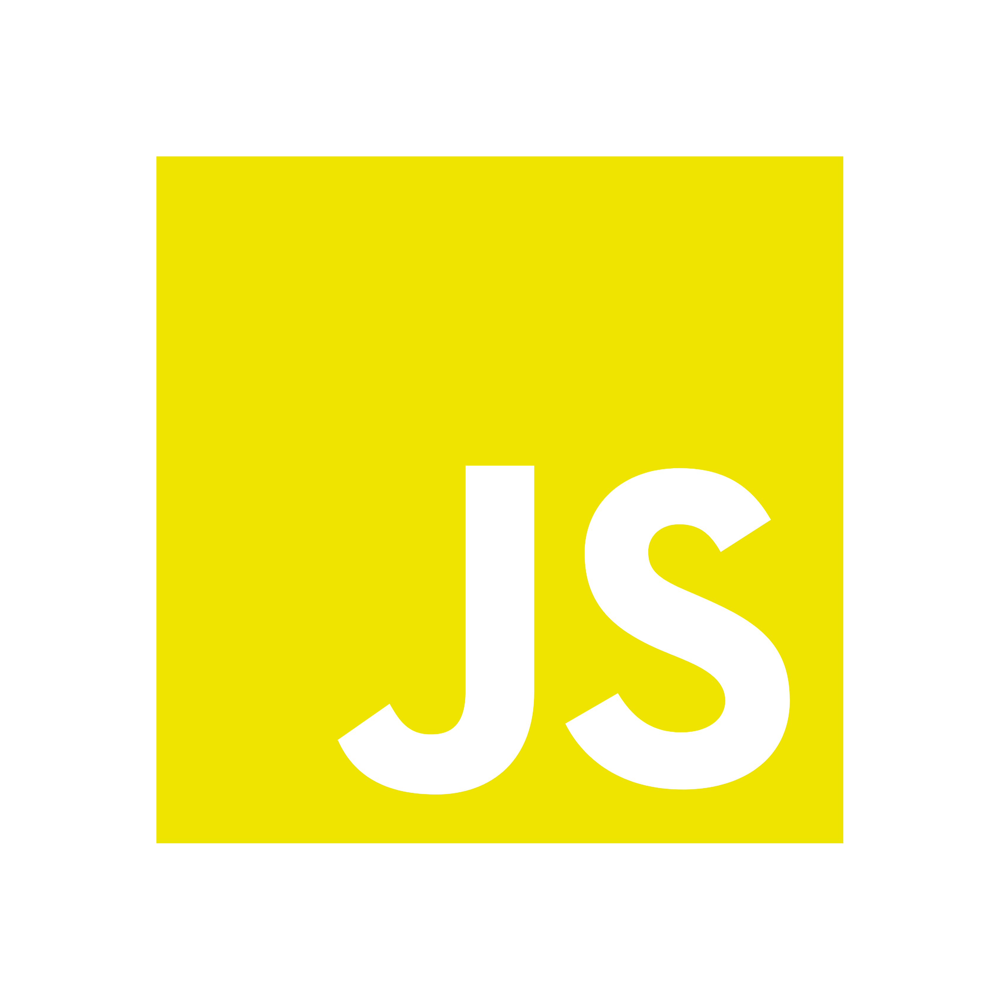
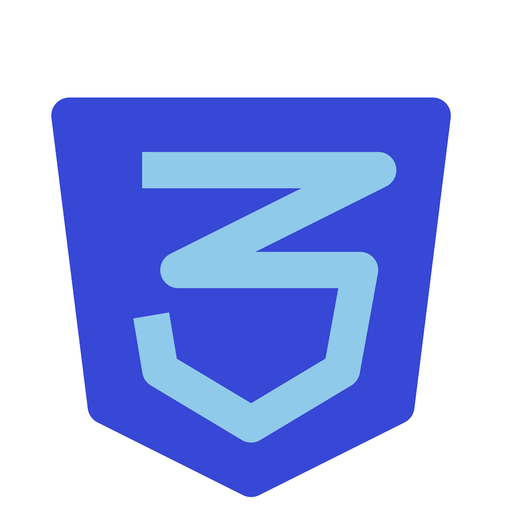
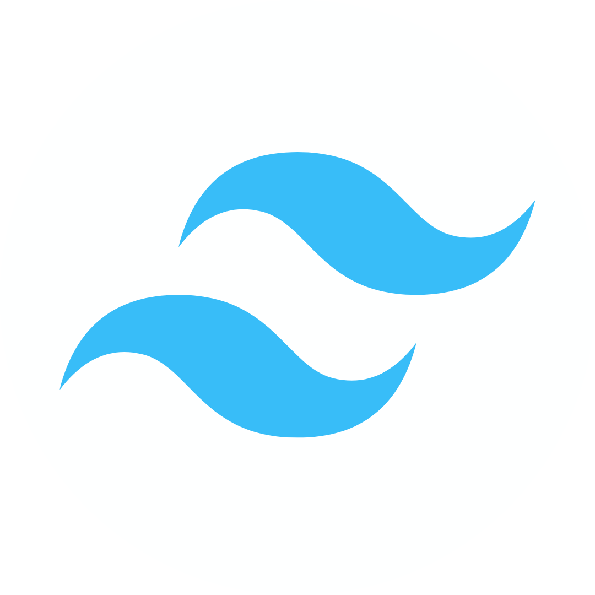
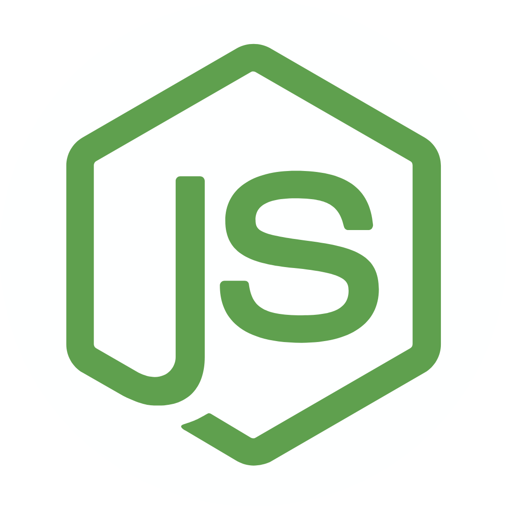
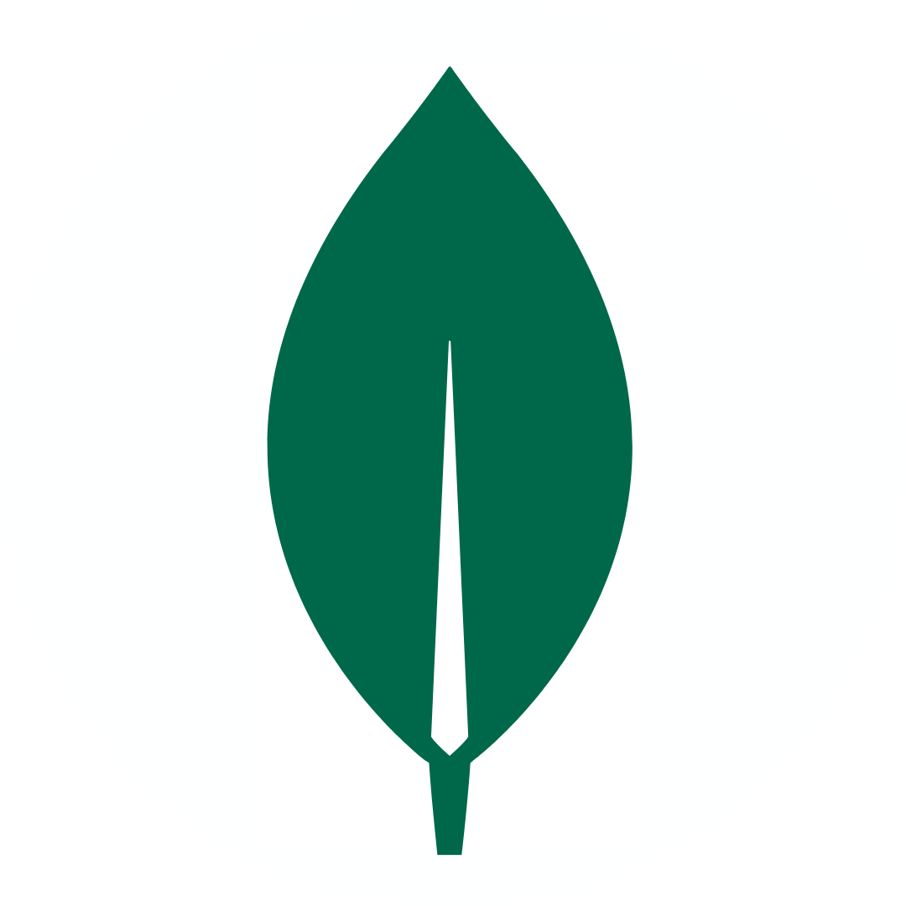
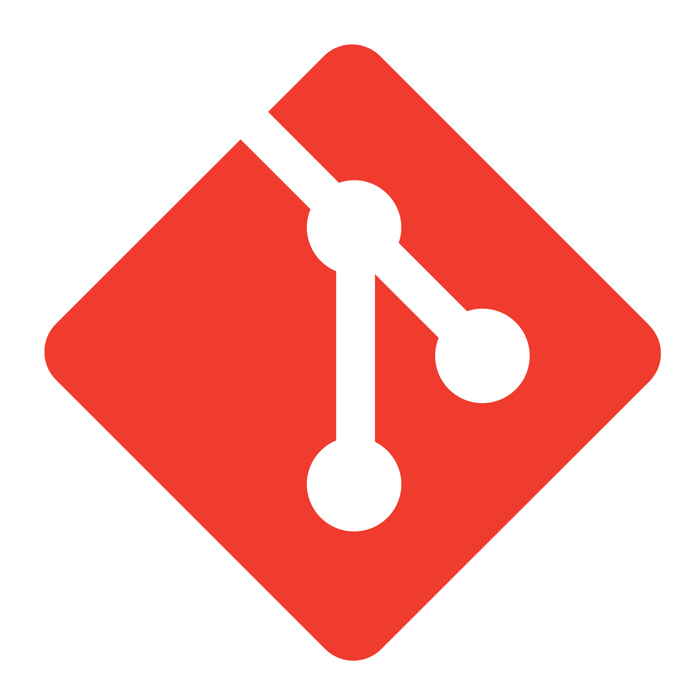

<h1 align="center">Hi 👋, I'm Tanishq Pawar</h1>
<h3 align="center">🌐 MERN Stack Developer | ⚡ React.js & Node.js Enthusiast | 🤝 Social-Tech Innovator</h3>

  
  
  

---

### 🔍 About Me

🎓 **B.Tech Graduate** in Computer Science and IT – Acropolis Institute of Technology and Research  
💡 Passionate about building meaningful tech that creates social impact  
🔧 Skilled in full-stack development using React.js, Node.js, MongoDB etc.

---

### 🚀 Projects

<table>
  <tr>

    <td align="center" width="300" style="padding: 10px;">
      
      <h3>Giftible.in</h3>
      
An eCommerce platform connecting NGOs with buyers to sell charity-based products.

      <strong>Stack:</strong> FastAPI, React, MySQL, Razorpay, Twilio 
      
    </td>

    <td align="center" width="300" style="padding: 10px;">
      
      <h3>Insider Jobs</h3>
      
Job portal built to connect real talent with real startups — faster hiring, smarter matching.

      <strong>Stack:</strong> React.js, Tailwind.css, Node.js, MongoDB, Clerk Authentication, Sentry 
      
    </td>

    <td align="center" width="300" style="padding: 10px;">
      
      <h3>Estate</h3>
      
Interactive real estate marketplace featuring multilingual support and seamless payment integration.

      <strong>Stack:</strong> React.js, Tailwind.css 
      
    </td>

    <td align="center" width="300" style="padding: 10px;">
      
      <h3>SABLE</h3>
      
Online shop for specially abled artisans with translation and payment integration.

      <strong>Stack:</strong> HTML, CSS, JS, Bootstrap, MySQL, Razorpay 
      
    </td>

  </tr>
</table>

---

### 🛠️ Tech Stack

  
    
    
    
    
  
  
  
  
  
  
   
    
    
  

---

### 📊 GitHub Stats

  
  

---

### ✨ Fun Facts

💻 I enjoy creating web projects, especially those that support real-world causes like specially-abled artisans  
🧠 I'm on a journey to master DSA and DevOps — one bug, one deploy at a time  
🏞️ I find peace in solo moments, whether it’s studying at the library or writing down thoughts in a quiet corner  

 

> _“I believe in building technology that empowers people and drives social good.”_
